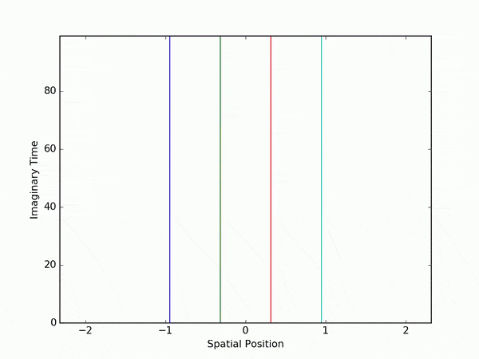

# 1DPIMC

1DPIMC is a C++ code that implements a Path Integral Quantum Monte-Carlo (PI-QMC) simulation of one-dimensional many body particle system.

### Description
The code allows to simulate a quantum system composed by **identical interacting particles moving in a one-dimensional space subjected to an external potential or trap**. In the PIMC algorithm, system configurations are sampled from the canonical partition function. Each particle is represented by closed discretized imaginary-time loop of length proportional to the inverse of the system temperature. The Monte-Carlo update algorithm applies a Metropolis step on each trajectory point proposing a random move of the particles positions. The algorithm itself and the discretization procedure are based on the work presented in the seminal paper by [Creutz and Freedman (1981)][1], so please refer to it for details about the simulation and the physics beyond it. The program permits to consider any number of particle and whatever form of the 1-particle potential or of the interaction term. It is possible to **simulate fermions or hard-core bosons**, which are equivalent in 1d space as proved by [Girardeau (1960)][2], and hence, for example, systems of electrons, trapped ions and so on.

Details about the code, parameter settings, action discretization and so on can be found in the [Wiki](https://github.com/ndrearu/1d_pimc/wiki), while a quick-start example is reported in the next section. Please **read the Wiki** before using the code! Also, the program is structured so that **it is very straightforward to modify or add routines** in order to handle different physical systems, modify the algorithm, add potential terms and so on.

[1]: https://doi.org/10.1016/0003-4916(81)90074-9
[2]: https://doi.org/10.1063/1.1703687


### Usage
After downloading and unpack the source code from the repository, run ``make`` from the parent directory to compile the program. Basic execution is performed by calling
the main executable file fed by a working directory, e.g. running
```
~$ ./bin/1d_pimc a_working_directory
```
The working directory must contain an ``init`` file in which all the simulation parameters are defined, and it will be also the place in which the output files will be written. The ``init`` file has the following form
```
~$ cat ./data/init
Nparticle    4
Ntau         100
tau          0.1
mass         1
boxlength    100

V1form       harmonic
V1pars       2 3. 0.
V2form       nointeraction
V2pars       1 0.0

MCsteps      5000
MCeach       10
MCstart      0
```
where the example refers to a simulation of four non-interacting impenetrable particles of unit mass subjected to an harmonic potential, placed in a very big box (with respect to the relevant physical scale of the system given by the harmonic trap) so that volume effects should be negligible. Here the program will perform 5000 Monte-Carlo updates starting from a cold configuration and measuring and saving observables and configurations each 10 steps. A fancy representation of the Monte-Carlo history of the paths is shown here below
<p align='center'>

</p>
where each trajectory represents a particle. Starting from a cold configuration (straight lines), the particles tend to be confined near the origin because of the harmonic trap. However, they cannot condensate since each particle is limited by the neighbors, so that the corresponding spatial density distribution would show four peaks (it is a one-dimensional non-interacting fermion gas in an harmonic trap).

At the end of the run, system configurations together with the value of the action and the acceptance of the algorithm are save into output files that can be use for a subsequent analysis of the data. A more detailed description of the code, the algorithm and the simulation parameters and of can be found in the [Wiki](https://github.com/ndrearu/1d_pimc/wiki) page.


### License
See the file [License.txt](LICENSE.txt).

### Author
Andrea Rucci, Department of Physics of University of Pisa and INFN Pisa

### Todos
- ~~Test parameters check routine after init file reading before creating classes~~
- ~~Check random number generator distribution on different threads~~
- ~~Simple test of the program on one-particle harmonic oscillator~~
- Modify setup of openmp number of threads
- Improve or change potential wrappers adding check on number of parameters
- Modify update routine allowing crossing between paths if needed

##### Last update 01/02/2018
